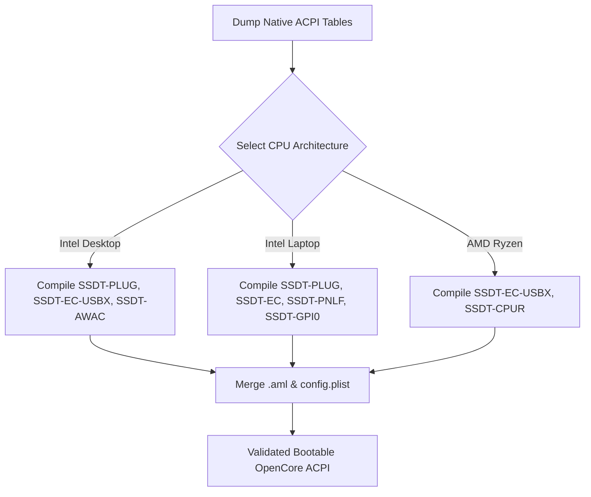

# Platform ACPI Patches & Batch Generation Guide

## 🗺️ Overview

RapidSSDT provides automated platform profiles that categorize, generate, and compile all necessary SSDTs for your hardware in a single click.

Whether configuring an Intel LGA1700 desktop, a Haswell laptop, or an AMD AM5 workstation, RapidSSDT reads your dumped ACPI tables, identifies hardware characteristics (such as whether AWAC is enabled in firmware or whether an EC device exists), and generates only the required AML tables.

---

## 🏗️ Platform Profiles & Generation Workflow

---

## 📊 Patch Classification Matrix

* **🟢 Core (Mandatory)**: Essential for boot and power management. Cannot be disabled.
  * Examples: `SSDT-PLUG`, `SSDT-EC-USBX`, `SSDT-AWAC`, `SSDT-CPUR`.
* **🟡 Recommended (Hardware Fixes)**: Resolves system-level conflicts on specific motherboards.
  * Examples: `SSDT-HPET` (Audio IRQ fix), `SSDT-RHUB` (USB reset), `SSDT-SBUS-MCHC` (SMBus controller).
* **🔵 Optional (Enhancements)**: Adds advanced functionality or power optimization.
  * Examples: `SSDT-PMC` (NVRAM write fix on 300-series), `SSDT-BRG0` (PCI Bridge injection for dGPU/NVMe), `SSDT-PCI-DISABLE` (Disable unsupported hardware).

---

## 🛠️ Step-by-Step Generation Steps

1. **Dump ACPI**: Click **[Dump ACPI]** on your Windows, Linux, or macOS workstation.
2. **Select Platform**: Choose your CPU architecture and form factor.
3. **Execute [Custom SSDT]**:
   - RapidSSDT decompiles the native DSDT table using `iasl`.
   - Locates target scopes (`_SB.PR00`, `_SB.PCI0.LPCB.EC0`, `_SB.AWAC`, etc.).
   - Compiles fully resolved `.aml` binaries into `ACPIs/Results`.
4. **Merge with OpenCore**:
   - Click **[Select config]** to point to your `config.plist`.
   - Click **[Merge config]** to copy the `.aml` files and update `ACPI -> Add` and `ACPI -> Patch` entries automatically.

---

## 🔗 Repository & Updates

* [RapidEFI GitHub Repository](https://github.com/alebypegasus/RapidEFI-Tool)
* [Releases & Changelog](https://github.com/alebypegasus/RapidEFI-Tool/releases)
