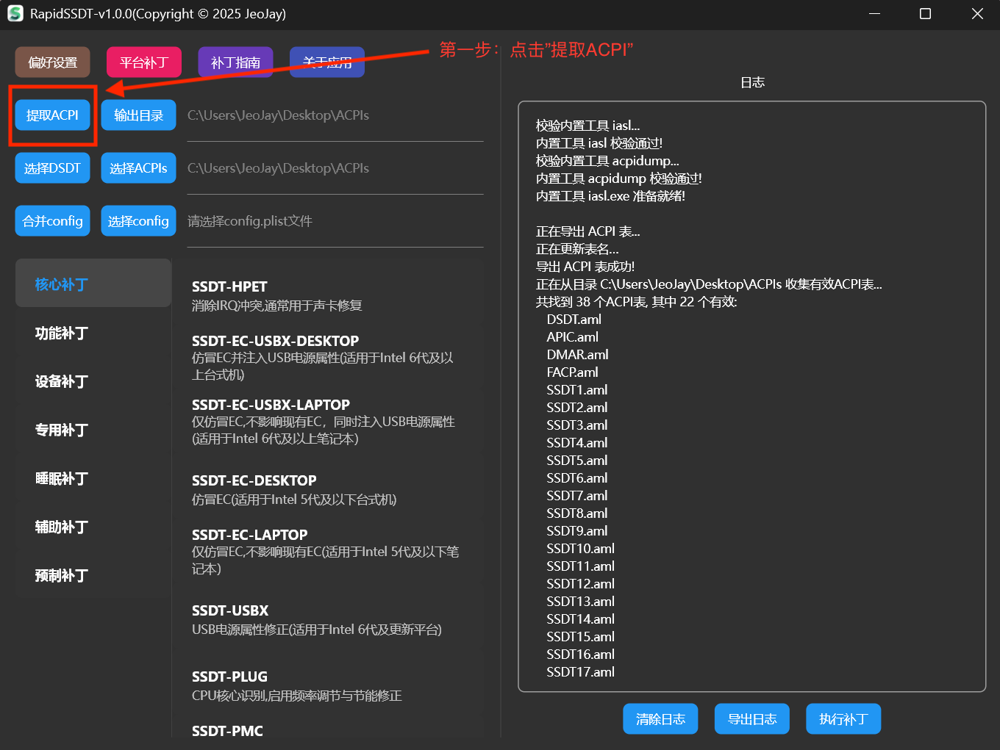
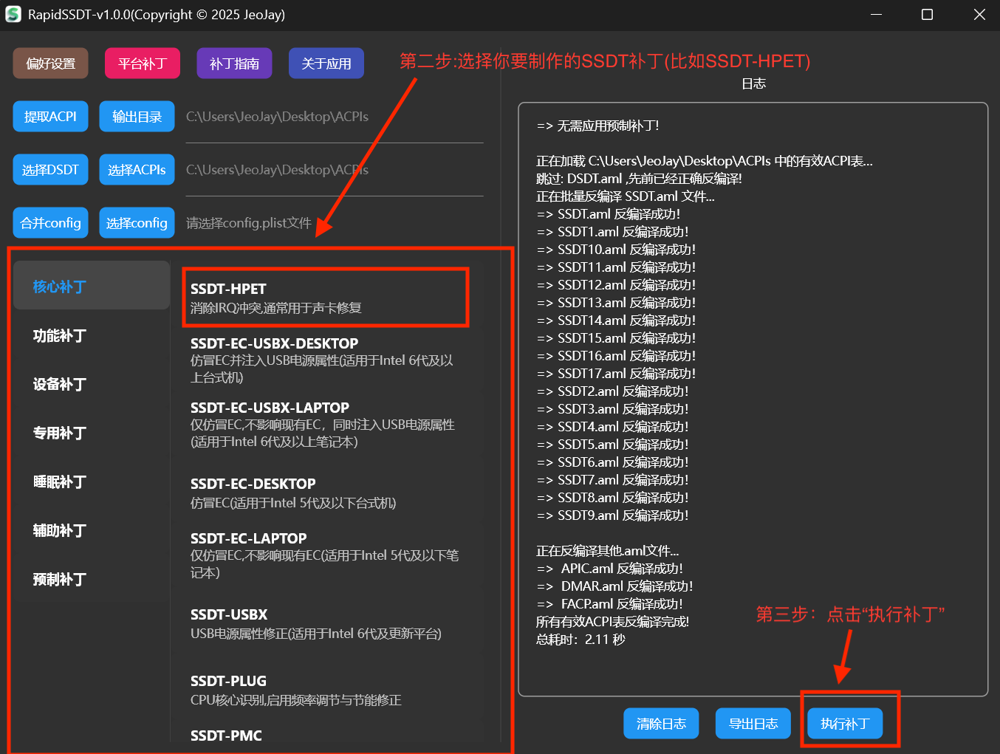
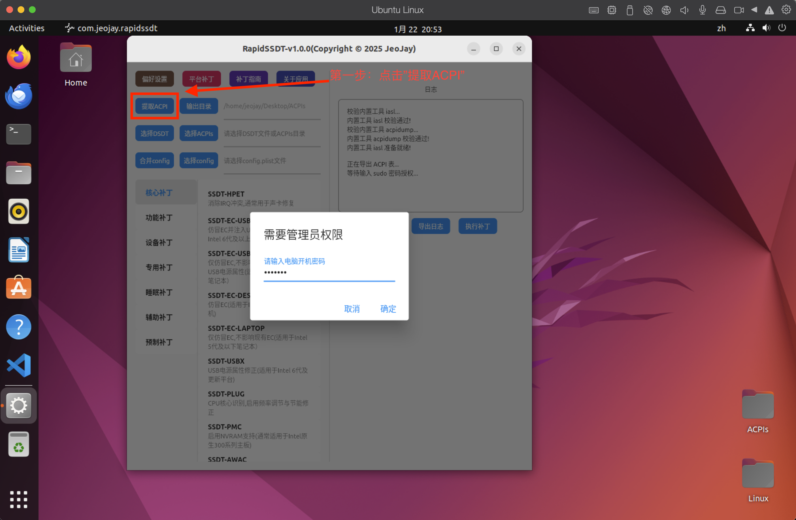
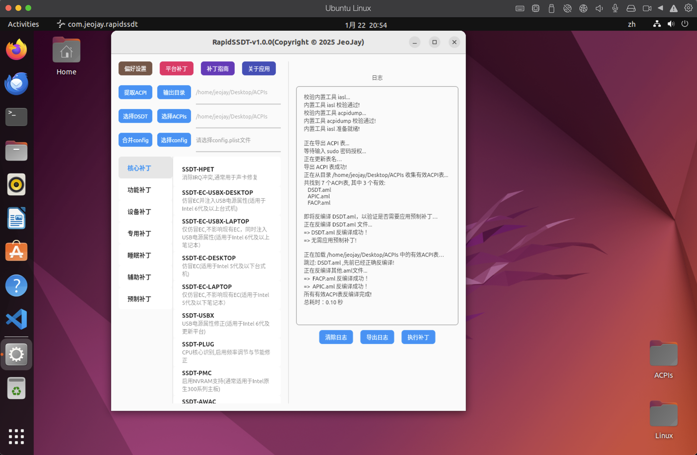
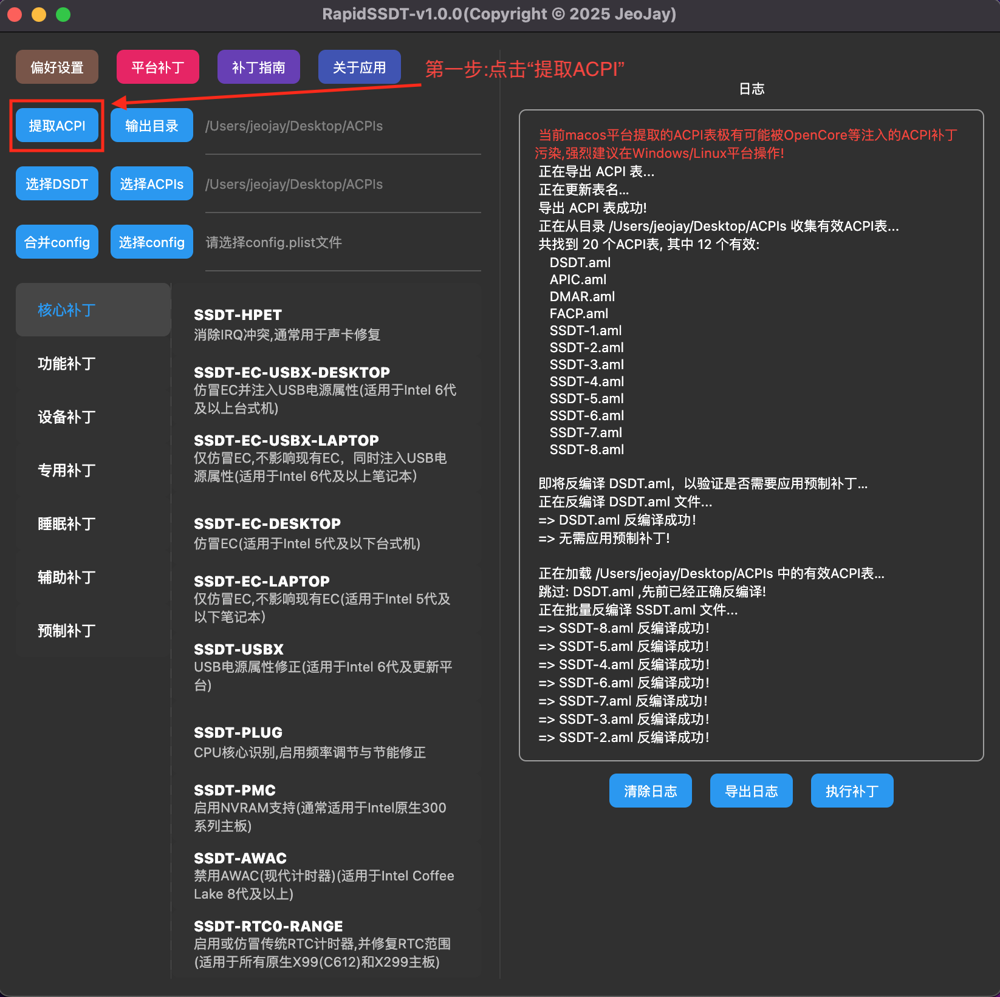
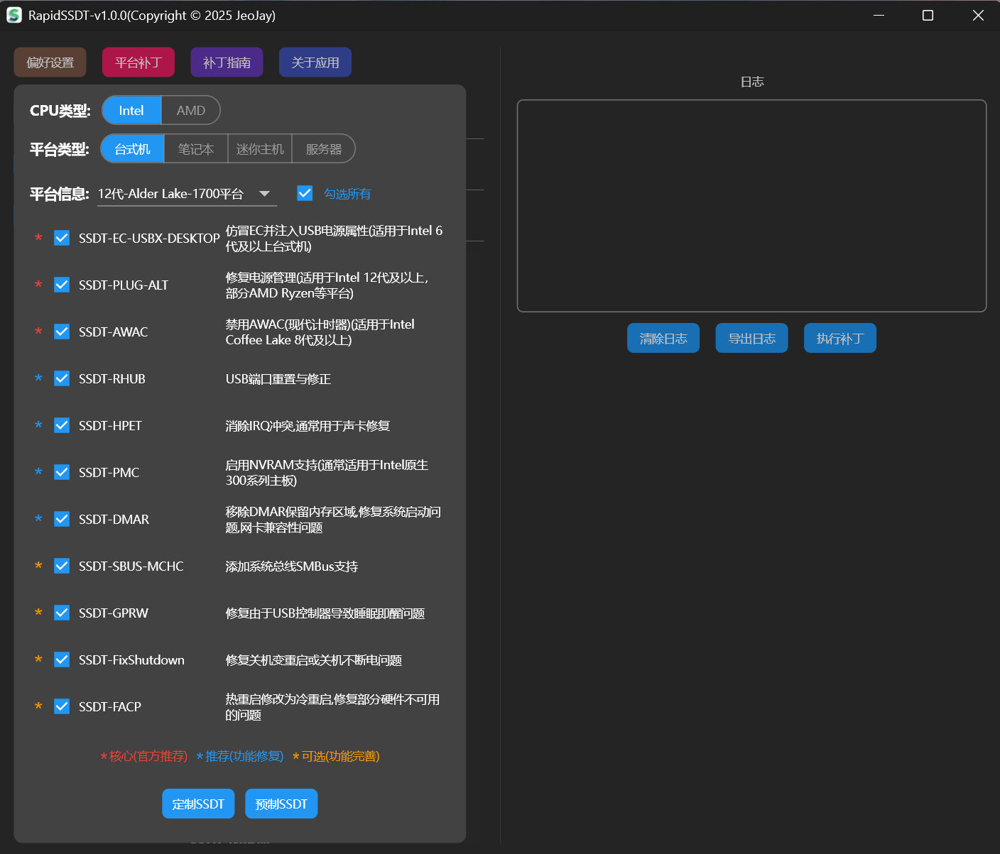
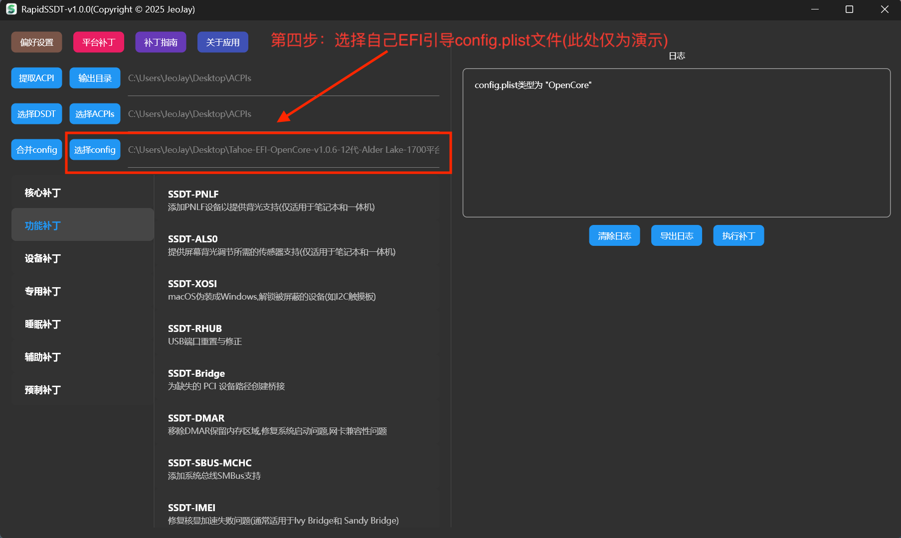
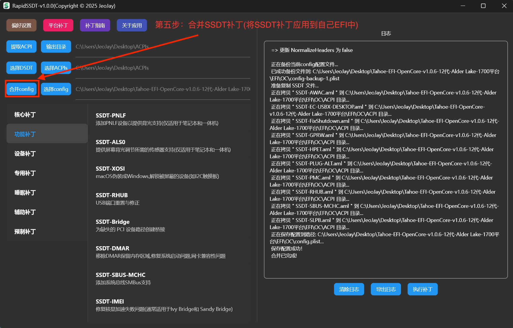
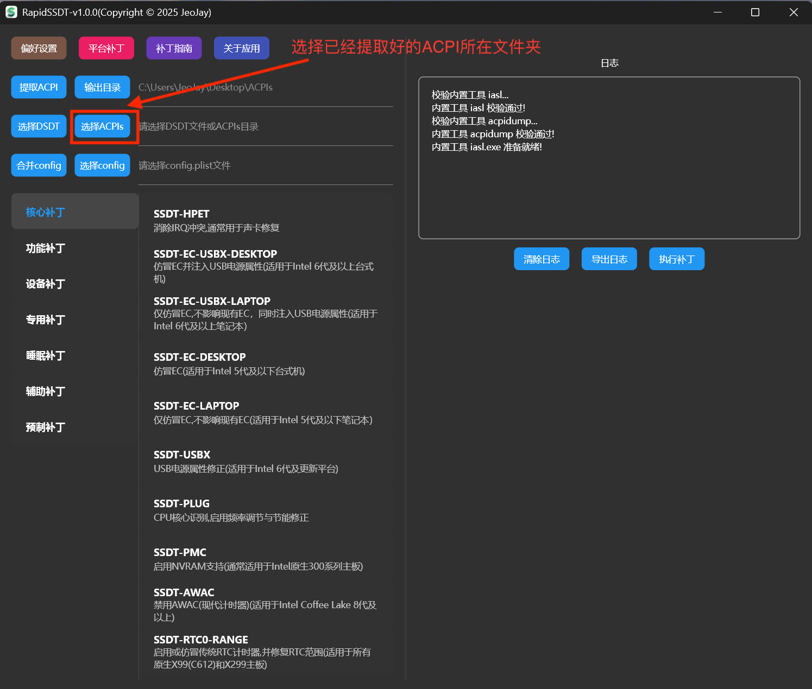

## RapidSSDT User Guide

- [1. Supported Bootloaders](#1-supported-bootloaders)
- [2. How to Extract Native SSDT and DSDT](#2-how-to-extract-native-ssdt-and-dsdt)
- [3. Determining Required SSDTs](#3-determining-required-ssdts)
- [4. Generating SSDT Patches with RapidSSDT](#4-generating-ssdt-patches-with-rapidssdt)
- [5. Batch Generating All SSDT Patches](#5-batch-generating-all-ssdt-patches)
- [6. Merging SSDT Patches into Your EFI](#6-merging-ssdt-patches-into-your-efi)
- [7. Detailed Patch Guides](#7-detailed-patch-guides)
- [8. Acknowledgments](#8-acknowledgments)

## Get Latest RapidSSDT Version

[Visit https://github.com/JeoJay127/RapidSSDT/releases to get the latest version](https://github.com/JeoJay127/RapidSSDT/releases)

## 1. Supported Bootloaders

RapidSSDT is not tied to a single bootloader, but is designed around **ACPI / SSDT patches** for all mainstream Hackintosh bootloaders.

- 🟢 **OpenCore** (Current mainstream, recommended)
  - Designed for OpenCore's ACPI loading mechanism
  - Generated SSDTs can be placed directly in `EFI/OC/ACPI`
  - Patch naming and structure adhere to OpenCore standards
  - Suitable for modern Hackintosh configurations

- 🟢 **Clover** (Legacy, deprecated)
  - Supports Clover's ACPI patch loading structure
  - Generated SSDTs can be placed in `EFI/CLOVER/ACPI/patched`
  - Compatible with legacy Clover workflows
  - Suitable for legacy systems still using Clover

## 2. How to Extract Native SSDT and DSDT

##### **Important Notes:**

If any of the following change, you must re-extract and re-patch, as ACPI tables (especially SystemMemory regions) may change significantly:

- BIOS updates
- Any BIOS settings change
- Hardware or RAM configuration changes

##### 2.1 Extraction via Windows (Recommended)

- Ensure you boot Windows directly via native UEFI Boot Manager. If you boot Windows through OpenCore, the extracted ACPI tables will be polluted by OpenCore's injected patches!

**Launch RapidSSDT on Windows (`rapidssdt.exe`), click [Dump ACPI] to extract native SSDTs and DSDT.**

**After extraction, the output defaults to the `ACPIs` folder on the Desktop. RapidSSDT will automatically select this directory for subsequent patching operations.**

##### 2.2 Extraction via Linux (Optional)

- If Linux is already installed, you can extract ACPI tables in Linux.

**In Linux, click [Dump ACPI] and enter sudo password to dump native SSDTs and DSDT.**

##### 2.3 Extraction via macOS (Not Recommended)

- Not recommended on macOS unless booted without any patched ACPI files, because bootloaders inject patches that contaminate the dumped ACPI tables.

**Under clean macOS boot, click [Dump ACPI] to extract native SSDTs and DSDT.**

## 3. Determining Required SSDTs

To help quickly determine required SSDTs, RapidSSDT provides Platform Patches that automatically list all required SSDTs (Core and Recommended) for the chosen platform.

**Note: For most platforms, [Core Patches] and [Recommended Patches] are sufficient. [Optional Patches] can be selected based on specific needs.**

Platform patches are determined by CPU type (Intel or AMD), platform form factor (Desktop, Laptop, Mini PC, Server), and generation based on Dortania's official guide: [https://dortania.github.io/Getting-Started-With-ACPI/ssdt-platform.html#desktop](https://dortania.github.io/Getting-Started-With-ACPI/ssdt-platform.html#desktop)

## 4. Generating SSDT Patches with RapidSSDT

### 4.1 Direct Extraction & Patching on Current Machine

Workflow: **[Dump ACPI] -> [Select SSDT Patch] -> [Execute Patch] -> [Select config] -> [Merge config]**

[Dump ACPI]:

[Select SSDT Patch] & [Execute Patch]:

[Select config]:

[Merge config]:

### 4.2 Patching Using Pre-dumped ACPIs from Another Machine

Workflow: **[Select ACPIs] -> [Select SSDT Patch] -> [Execute Patch] -> [Select config] -> [Merge config]**

Select the folder containing the dumped DSDT/SSDT files:

## 5. Batch Generating All SSDT Patches

### 5.1 Direct Batch Generation for Current Machine

Workflow: **[Dump ACPI] -> [Platform Patches] -> [Custom SSDT] -> [Select config] -> [Merge config]**

[Dump ACPI]:

[Platform Patches] & [Custom SSDT]:

[Select config]:

[Merge config]:

### 5.2 Batch Generation for Pre-dumped ACPIs

Workflow: **[Select ACPIs] -> [Platform Patches] -> [Custom SSDT] -> [Select config] -> [Merge config]**

**RapidSSDT Platform Patch Legend:**
- **[Core (Official Recommended)]**: Mandatory selection, cannot be unchecked.
- **[Recommended (Fixes)]**: Recommended for functional fixes; can be adjusted.
- **[Optional (Enhancements)]**: Optional improvements based on hardware requirements.
- **[Select All]**: Selects all core, recommended, and optional SSDTs. Unchecking restores selection to Core only.
- **[Custom SSDT]**: Automatically generates fully customized SSDTs based on dumped DSDT & SSDT tables in one click.
- **[Prebuilt SSDT]**: Generates standard generic SSDTs based on Dortania guidelines without analyzing local tables.

## 6. Merging SSDT Patches into Your EFI

Workflow: **[Select ACPIs] -> [Select config] -> [Merge config]**

[Select ACPIs] (Choose folder containing generated SSDTs):

[Select config] (Select target `config.plist` from your EFI):

[Merge config]:

## 7. Detailed Patch Guides

- 7.1 [SSDT-HPET Audio IRQ Fix](audio_patch.md)
- 7.2 [SSDT-PNLF Laptop & AIO Brightness Control](brightness_patch.md)
- 7.3 [SSDT-GPU-SPOOF Graphics Spoofing](gpu_spoof.md)
- 7.4 [SSDT-PCI-DISABLE Device Disabling](disable_devices.md)

## 8. Acknowledgments

- [CorpNewt](https://github.com/CorpNewt) - ACPI guides and sample patches
- [RehabMan](https://github.com/RehabMan) - ACPI patching techniques and iasl tools
- [acidanthera](https://github.com/acidanthera) - OpenCore and kext guidance
- [dortania](https://github.com/dortania) - OpenCore Install Guide and ACPI references
